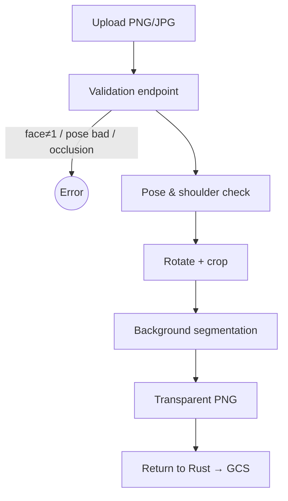

# PFP Validator

[https://github.com/Raphmatt/face-detection/assets/71792812/2c9d941f-e80d-4973-95be-1a36a9904cf2](https://github.com/Raphmatt/face-detection/assets/71792812/2c9d941f-e80d-4973-95be-1a36a9904cf2)

Server‑side **FastAPI** micro‑service that **validates** and **optimises** user‑uploaded profile photos. It detects faces, checks pose & occlusions, removes the background, aligns the face to a uniform template and streams back a transparent PNG.

> **Context** Created for the Swiss VET module **M321 – "Verteilte Systeme programmieren"** (GIBZ). Goal: design, build, test & integrate an independent service into an existing distributed backend (mobile → Rust → GCS).

---

## 1 - Project Brief (assignment summary)

**Objective** Add automated _content validation_ and _optimisation_ for profile photos stored in Google Cloud.

### Validation rules

1. Exactly **one** human face must be present.
2. Face must be **fully visible** and **frontal** (limited rotation on all axes).
3. **No occlusions** (masks, sunglasses, pets …).
4. Shoulders roughly level (prevents tilted selfies).

### Optimisation after successful validation

- **Background removal** → transparent PNG.
- **Uniform crop & scale** so all accepted faces appear equally sized and positioned.

Additional deliverables: architecture & flow diagrams, design‑decision notes, minimal data‑model, demo video, Docker‑ready build.

---

## 2 - Core Capabilities

| Phase            | What happens                                                           | Tech                                      |
| ---------------- | ---------------------------------------------------------------------- | ----------------------------------------- |
| **Validation**   | Reject if rule fails: face≠1, not frontal, occlusion, shoulders tilted | MediaPipe FaceMesh & Pose + dlib fallback |
| **Optimisation** | Rotate/scale to template, crop to fixed W×H, transparent PNG           | Custom `FaceAligner`, MediaPipe Segmenter |
| **Delivery**     | Stream PNG to caller                                                   | FastAPI                                   |

---

## 3 - Tech Stack

**Core Technologies:**

- Python 3.11
- FastAPI 0.105
- Uvicorn

**ML & Computer Vision:**

- **MediaPipe** 0.10
- **dlib** 19.24
- NumPy 1.26
- OpenCV‑headless
- Pillow 10

**Development & Deployment:**

- PyTest 7.4 (~85% coverage)
- Docker & Compose
- GitLab CI

---

## 4 - Repository Layout

```
src/
  app.py            ASGI app
  router.py         API routes
  service.py        Orchestration layer
  face_utilities.py Validation & segmentation logic
  face_aligner.py   Rotation / scaling / crop
  image_utilities.py Upload & conversion helpers
  tests/            PyTest suite
scripts/            Standalone tools (PEP 723)
poc/                Prototype scripts
Dockerfile, compose.yaml, .gitlab-ci.yml
```

---

## 5 - Run & Test

```bash
# Docker (recommended)
docker compose up --build   # → http://localhost:8000/docs

# Local (uv)
uv sync
uv run uvicorn src.app:app --reload

# Tests
uv run pytest -q

# Lint & format
uv run ruff check src/
uv run ruff format src/
```

---

## 5.5 - ML Model Downloads

This project uses pre-trained models from MediaPipe and dlib. The models are currently stored in the repository, but can be downloaded from their original sources.

### MediaPipe Models

#### BlazeFace (Short-Range)

- **Purpose**: Lightweight face detection optimized for selfie-like images
- **Architecture**: Single Shot Detector (SSD) with custom encoder
- **Input**: 128 x 128, float16
- **Download**: [`blaze_face_short_range.tflite`](https://storage.googleapis.com/mediapipe-models/face_detector/blaze_face_short_range/float16/latest/blaze_face_short_range.tflite)
- **Documentation**: [MediaPipe Face Detector](https://ai.google.dev/edge/mediapipe/solutions/vision/face_detector#blazeface_short-range)
- **Model Card**: [BlazeFace Model Card](https://storage.googleapis.com/mediapipe-assets/MediaPipe%20BlazeFace%20Model%20Card%20(Short%20Range).pdf)

#### Pose Landmarker (Lite)

- **Purpose**: Human pose detection and 33-point 3D landmark estimation
- **Architecture**: ConvNet similar to MobileNetV2 with GHUM 3D modeling
- **Input**: Pose detector (224 x 224 x 3), Pose landmarker (256 x 256 x 3), float16
- **Download**: [`pose_landmarker_lite.task`](https://storage.googleapis.com/mediapipe-models/pose_landmarker/pose_landmarker_lite/float16/latest/pose_landmarker_lite.task)
- **Documentation**: [MediaPipe Pose Landmarker](https://ai.google.dev/edge/mediapipe/solutions/vision/pose_landmarker#models)
- **Model Card**: [BlazePose GHUM 3D Model Card](https://storage.googleapis.com/mediapipe-assets/Model%20Card%20BlazePose%20GHUM%203D.pdf)

#### Selfie Multiclass Segmentation

- **Purpose**: Multi-class image segmentation for people, identifying hair, skin, clothes, and accessories
- **Output Categories**: 0-background, 1-hair, 2-body-skin, 3-face-skin, 4-clothes, 5-others (accessories)
- **Input**: 256 x 256, float32
- **Download**: [`selfie_multiclass_256x256.tflite`](https://storage.googleapis.com/mediapipe-models/image_segmenter/selfie_multiclass_256x256/float32/latest/selfie_multiclass_256x256.tflite)
- **Model Card**: [Multiclass Segmentation Model Card](https://storage.googleapis.com/mediapipe-assets/Model%20Card%20Multiclass%20Segmentation.pdf)

#### Selfie Segmentation (Square)

- **Purpose**: Portrait segmentation for background replacement and modification
- **Output Categories**: 0-background, 1-person
- **Input**: 256 x 256, float16
- **Download**: [`selfie_segmenter.tflite`](https://storage.googleapis.com/mediapipe-models/image_segmenter/selfie_segmenter/float16/latest/selfie_segmenter.tflite)
- **Model Card**: [Selfie Segmentation Model Card](https://storage.googleapis.com/mediapipe-assets/Model%20Card%20MediaPipe%20Selfie%20Segmentation.pdf)

### dlib Models

- **Shape Predictor**: Used as fallback for facial landmark detection
- **Download**: [`shape_predictor_68_face_landmarks.dat.bz2`](https://dlib.net/files/shape_predictor_68_face_landmarks.dat.bz2)

### Download Script

```bash
# Create model directories
mkdir -p src/models/mp_models/face_detection
mkdir -p src/models/mp_models/pose_detection
mkdir -p src/models/mp_models/segmentation
mkdir -p src/models/dlib_models

# Download BlazeFace (Short-Range)
curl -L "https://storage.googleapis.com/mediapipe-models/face_detector/blaze_face_short_range/float16/latest/blaze_face_short_range.tflite" \
  -o src/models/mp_models/face_detection/blaze_face_short_range.tflite

# Download Pose Landmarker (Lite)
curl -L "https://storage.googleapis.com/mediapipe-models/pose_landmarker/pose_landmarker_lite/float16/latest/pose_landmarker_lite.task" \
  -o src/models/mp_models/pose_detection/pose_landmarker_lite.task

# Download MediaPipe Selfie Multiclass Segmentation model
curl -L "https://storage.googleapis.com/mediapipe-models/image_segmenter/selfie_multiclass_256x256/float32/latest/selfie_multiclass_256x256.tflite" \
  -o src/models/mp_models/segmentation/selfie_multiclass_256x256.tflite

# Download MediaPipe Selfie Segmentation model (square)
curl -L "https://storage.googleapis.com/mediapipe-models/image_segmenter/selfie_segmenter/float16/latest/selfie_segmenter.tflite" \
  -o src/models/mp_models/segmentation/square_selfie_segmenter.tflite

# Download dlib shape predictor (compressed)
curl -L "https://dlib.net/files/shape_predictor_68_face_landmarks.dat.bz2" \
  -o src/models/dlib_models/shape_predictor_68_face_landmarks.dat.bz2

# Extract dlib model
bunzip2 src/models/dlib_models/shape_predictor_68_face_landmarks.dat.bz2
```

---

---

## 6 - HTTP API

### `GET /heartbeat`

```json
{ "status": "ok" }
```

### `POST /image/process`

Multipart upload with `file=<image>` and query params:

| Param                                                          | Default       | Purpose                                    |
| -------------------------------------------------------------- | ------------- | ------------------------------------------ |
| `bounds`                                                       | `false`       | Allow face to exceed frame after alignment |
| `side_spacing`                                                 | `0.72`        | Horizontal eye‑to‑edge ratio               |
| `top_spacing`                                                  | `0.4`         | Vertical eye position                      |
| `width` / `height`                                             | `512` / `640` | Output size (px)                           |
| `binary_method`                                                | `multiclass`  | `multiclass` (accurate) or `selfie` (fast) |
| Responds **200 → `image/png`** or **4xx → `{ "error": "…" }`** |               |                                            |

---

## 7 - Processing Pipeline (high‑level)



---

## 8 - Design Highlights

- Local CV models → privacy, zero vendor cost.
- Rust backend integration → no mobile‑app changes, minimal GCS writes.
- Transparent PNG works everywhere.
- All template offsets & sizes tunable via query string.
- Modular helpers → swap in ONNX/OpenVINO easily.

---

## 9 - Module M321 Scoring

| #         | Criterion                  | Max    | **Achieved** |
| --------- | -------------------------- | ------ | ------------ |
| 1         | Architecture diagram       | 4      | **3.50**     |
| 2         | Sequence / flow diagram    | 2      | **2.00**     |
| 3         | Design decisions           | 3      | **2.00**     |
| 4         | Flexibility                | 3      | **2.50**     |
| 5         | Minimum requirements met   | 5      | **5.00**     |
| 6         | System‑component rationale | 2      | **1.00**     |
| 7         | Technical quality          | 3      | **3.00**     |
| 8         | Demo video                 | 3      | **2.75**     |
| 9         | Integration readiness      | 3      | **3.00**     |
| 10        | Bonus                      | 3      | **3.00**     |
| **Total** |                            | **31** | **27.75**    |

_Table reproduced from the official assessment sheet._ Grading rule: **TOTAL − 3** → 31 − 3 = 28 effective points. Grade is scaled linearly: `6 / 28 * 27.75 = 5.95 ≈ 6.0`. We therefore received **grade 6 of 6** (27.75 / 31 pts), and all mandatory requirements were met.

---

## 10 - Credits 🏆

Major components: MediaPipe integration, face‑alignment pipeline, overall architecture were developed by **Raphael Andermatt ([@raphmatt](https://github.com/raphmatt))**. Thanks to Team 3 colleagues (Pascal Bitterli, Emre Ceylan, Arjanis Kovani) for testing, docs & DevOps.

---

## 11 - License

MIT – Fork & adapt as needed.
