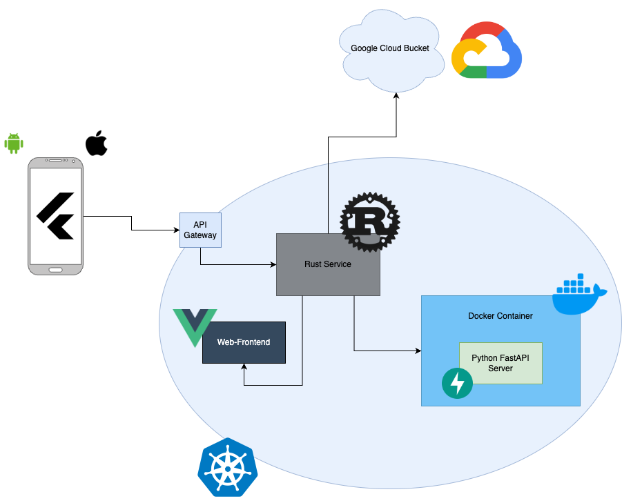
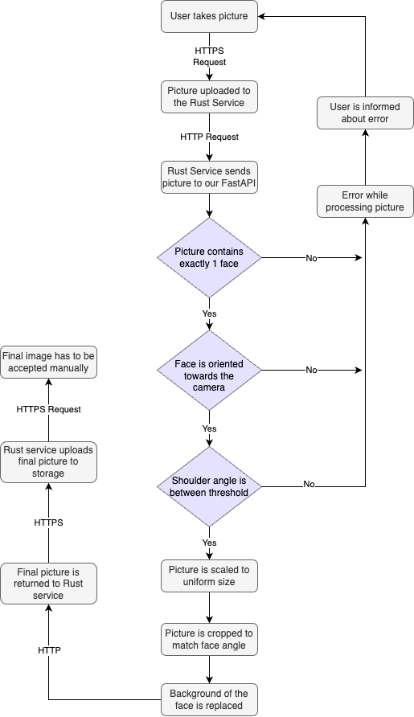

# pfp validator

## Setup

1. Klonen Sie das Projekt auf Ihren Rechner.

    ```bash
    git clone git@gitlab.com:GIBZ/students/infa3a2023/face-detection.git
    ```

2. Starten Sie das Projekt mit Docker.

    ```bash
    docker compose up --build
    ```

3. Öffnen Sie die Swagger-Seite [docs](http://localhost:8000/docs).

# Todo

- [x] Docker
  - [x] Dockerfile
  - [x] docker-compose.yml
- [ ] API
  - [ ] FastAPI Functionality
    - [x] Human Face detection
      - [x] Face count detection
    - [ ] Face visibility
      - [ ] Face looking towards
        - [x] Detect face angle
        - [ ] Adjust face angle / threshold for face angle
      - [ ] Shoulder angle
        - [x] Detect shoulder angle
        - [ ] threshold for shoulder angle
      - [ ] Face visible from the front (WIP Pacal)
        - [ ] Detect face horizontal angle
        - [ ] threshold for face horizontal angle
      - [ ] Face not occluded by an object (Tricky task, tried with facemesh, but occlusion cannot be detected)
        - [ ] Detect occlusion
    - [x] Image optimization
      - [x] Remove background
        - [x] Get mask of background
        - [x] Remove background
      - [x] Uniform cropping to the face (WIP Raphael)
        - [x] Detect face position
        - [x] Crop image to face position
        - [x] Resize image to uniform size
        - [x] Rotate image to uniform angle
      - [x] Uniform aspect ratio (WIP Raphael)
        - [x] Apply uniform aspect ratio
      - [x] Constant, absolute dimensions (e.g. 500x500px) 
        - [x] Scale image to constant, absolute dimensions


# Requirements:

- Validation
  - Is a human face visible in the image?
  - Is the face completely visible?
  - Is the face visible from the front and not at an angle or from the side?
  - Is the face not occluded by an object? (e.g. Mask, Pet, Sunglasses, etc.)
- Optimization
  - Remove the background, so that the person is shown in front of a transparent background.
  - Uniform cropping of the image, so that all faces are shown in the same size, orientation and position.
  - The resulting image should be saved in a uniform aspect ratio with constant, absolute dimensions.
- Additional
  - Is the person a celebrity?

## Original Requirements


### Validierung der Profilfotos

Die Inhaltliche Validierung der Profilfotos umfasst zumindest folgende Aspekte (Mindestanforderungen):

- Auf dem Foto soll genau ein menschliches Gesicht erkennbar sein.
- Das Gesicht auf dem Foto muss vollständig sichtbar sein.
- Das Gesicht muss frontal aufgenommen sein. Der Kopf darf also in keiner Achse zu stark geneigt sein.
- Das Gesicht darf nicht durch verdeckt sein (z.B. durch Masken, Haustiere, Sonnenbrillen, ...).

### Optimierung der Profilfotos

Sofern alle relevanten Validierungen erfolgreich abgeschlossen werden konnten, sollen die Profilfotos für die weitere Verwendung optimiert werden.

#### Entfernung des Hintergrundes

Der Hintergrund soll entfernt werden. Als Endprodukt soll ein Profilfoto resultieren, in welchem die fotografierte Person freigestellt, vor einem transparenten Hintergrund abgebildet ist. Bezüglich Dateiformat existieren keine weiteren Vorgaben, ein breites Einsatzspektrum soll jedoch angestrebt werden.

#### Uniformer Zuschnitt

Alle Profilbilder sollen einen uniformen Zuschnitt erfahren, damit die fotografierten Gesichter grundsätzlich gleich gross erscheinen. Bei der Ausrichtung, Positionierung und Grösse des Gesichts sollen nach Möglichkeit geltende Standards oder Konventionen angewendet werden. Das resultierende Foto soll in einem uniformen Seitenverhältnis mit konstanten, absoluten Dimensionen persistiert werden.

## Schnittstellen

Die Python FastAPI bietet zwei Schnittstellen:

| Request-Typ | Request-Pfad       | Request-Body     | Beschreibung                           |
|-------------|--------------------|------------------|----------------------------------------|
| **GET**     | /heartbeat         | Keine Parameter  | Gibt den Status des Services zurück    |
| **POST**    | /image/process     | Ein .png-Bild    | Verarbeitet das Bild und sendet es zurück|

## Ablauf

Der User sendet das Bild von seinem Smartphone an den Rust Service. Dieser postet es in unserem FastAPI Service, der das Bild analysiert, bearbeitet und schließlich zurückgibt. Im Rust Service wird das finale Bild, wie gewohnt, in den Google Bucket geladen.

### Architekturdiagramm

{width=60%}

### Flowdiagramm

{width=30%}

## Flexibilität

In unserem Projekt wurden die einzelnen Schritte der Bildbearbeitung in verschiedene Funktionen aufgeteilt. Dadurch können sie leicht ausgetauscht oder erweitert werden. 

Auch im Rust Service könnte man die URL einfach auf einen anderen Service verweisen, solange sich die Parameter und das Rückgabeformat nicht ändern.

## Systemkomponenten / Frameworks


## Qualität der Lösung

### Vorteile

- Unser Service wird nur im Backend hinzugefügt. Der User muss dadurch keine Updates oder ähnliches durchführen und bekommt nichts davon mit

- Wir verwenden keine externen Services, wie Google Vision oder AWS Rekognition, sondern führen alles lokal aus. Dadurch wird der Datenschutz der Schüler gewährleistet.

- Die Performance unserer Lösung ist bereits in Ordnung, könnte jedoch leicht durch anpassen der Cloud Umgebung skaliert werden.

- Durch das Verzichten auf externe Anbieter sparen wir Kosten.

### Nachteile

- Wir mussten sehr viel Zeit in das lernen von Computer Vision und die eigentliche Implementation investieren. Dies wäre durch das verwenden eines externen Services sicher leichter gefallen.


## Video

_**PLACEHOLDER**_

## Integration ins Gesamtsystem

Das Einbinden in das Gesamtsystem, wie auch im Diagramm gezeigt, ist nicht aufwändig, und die erforderlichen Code-Änderungen wurden durchgeführt.

## Bonus

Besonders stolz sind wir auf die Implementierung der Hintergrundentfernung, die ein integriertes Smoothing verwendet. Ebenso beeindruckend ist die automatische Ausrichtung des Fotos abhängig vom Winkel des Gesichts. Dabei wird auch berücksichtigt, wie weit das Gesicht von der Kamera entfernt ist, und man erhält dadurch ein einheitliches, finales Bild.

Diese herausragende Lösung verdanken wir Raphael Andermatt, der dafür viel Zeit und Mühe investiert hat.
