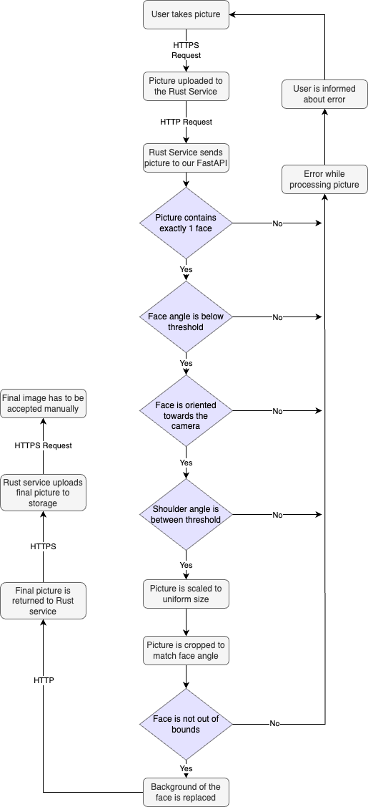

# pfp validator

## Setup

### Requirements

- Python 3.11
- Docker 

1. Klonen Sie das Projekt auf Ihren Rechner.

    ```bash
    git clone git@gitlab.com:GIBZ/students/infa3a2023/face-detection.git
    ```

2. Starten Sie das Projekt mit Docker.

    ```bash
    docker compose up --build
    ```

3. Öffnen Sie die Swagger-Seite [docs](http://localhost:8000/docs).


## Schnittstellen

Die Python FastAPI bietet zwei Schnittstellen:

| Request-Typ | Pfad       | Body     | Beschreibung |
|-------------|--------------------|------------------|----------------------------------------|
| **GET**     | /heartbeat         | Keine Parameter  | Gibt den Status des Services zurück    |
| **POST**    | /image/process     | Ein .png-Bild    | Verarbeitet das Bild und sendet es zurück|

### Parameter "image/process"

| Parameter | Default | Typ | Beschreibung |
| ---- | ---- | ---- | ---- |
| bounds | False | boolean | Erlaube sichtbare Bildkanten |
| side_spacing | 0.72 | number | Abstand der Augen zum Bildrand <br> 0 = Augen am Rand <br> 0.9998 = Augen zentriert von weitem |
| top_spacing | 0.4 | number | vertikale Position der Augen <br> 0 = Augen am oberen Rand <br> 0.9998 = Augen am unteren Rand |
| width | 512 | integer | Breite des finalen Bildes |
| height | 640 | integer | Höhe des finalen Bildes |
| binary_method | multiclass | string | Methode, mit welcher der Hintergrund <br> entfernt wird <br>multiclass = genauer, langsamer <br> selfie = ungenauer, schneller |

## Ablauf

Der User sendet das Bild von seinem Smartphone an den Rust Service. Dieser postet es in unserem FastAPI Service, der das Bild analysiert, bearbeitet und schliesslich zurückgibt. Im Rust Service wird das finale Bild, wie gewohnt, in den Google Bucket geladen.

### Architekturdiagramm

{width=60%}

### Flowdiagramm

{width=30%}

## Flexibilität

In unserem Projekt wurden die einzelnen Schritte der Bildbearbeitung in verschiedene Funktionen aufgeteilt. Dadurch können sie leicht ausgetauscht oder erweitert werden. 

Auch im Rust Service könnte man die URL einfach auf einen anderen Service verweisen, solange sich die Parameter und das Rückgabeformat nicht ändern.

## Systemkomponenten / Frameworks


## Designentscheid

Wir haben uns dafür entschieden Mediapipe zu nutzen auf Grund der hohen Konfigurierbarkeit und der Möglichkeit zur lokalen Ausführung. Ebenfalls bietet es sich an, dass wir unsere Kenntnise über Computer Vision erweitern können und dabei noch unsere Python Skills vertiefen.

Bei der Implementation in die existierende GIBZ Lösung haben wir uns drei Varianten überlegt:

1. Aufruf direkt über den Mobile Client
2. Aufruf im Rust Service
3. Aufruf im Web-Frontend

Schlussendlich haben wir uns für die **zweite** Methode entschieden aus den folgenden Gründen:

- keine Updates im Mobile Client notwendig, welche eventuell schwieriger zu implementieren/deployen sein könnten

- die Read- / Write-Prozesse im Google Bucket werden auf einem Minimum gehalten, da wir davon ausgehen, dass eine hohe Anzahl Requests zu höheren Kosten führen würde

## Qualität der Lösung

### Vorteile

- Unser Service wird nur im Backend hinzugefügt. Der User muss dadurch keine Updates oder ähnliches durchführen und bekommt nichts davon mit.

- Wir verwenden keine externen Services, wie Google Vision oder AWS Rekognition, sondern führen alles lokal aus. Dadurch wird der Datenschutz der Schüler gewährleistet.

- Die Performance unserer Lösung ist bereits in Ordnung, könnte jedoch leicht durch Anpassen der Cloud Umgebung skaliert werden.

- Durch das Verzichten auf externe Anbieter sparen wir Kosten.


### Nachteile

- Wir mussten sehr viel Zeit in das lernen von Computer Vision und die eigentliche Implementation investieren. Dies wäre durch das verwenden eines externen Services sicher leichter gefallen.

## Umgesetzt

- [x] Auf dem Foto soll genau ein menschliches Gesicht erkennbar sein.
- [x] Das Gesicht auf dem Foto muss vollständig sichtbar sein.
- [x] Das Gesicht muss frontal aufgenommen sein. Der Kopf darf also in keiner Achse zu stark geneigt sein.
- [x] Das Gesicht darf nicht durch verdeckt sein (z.B. durch Masken, Haustiere, Sonnenbrillen, ...).


## Integration ins Gesamtsystem

Das Einbinden in das Gesamtsystem, wie auch im Diagramm gezeigt, ist nicht aufwändig, und die erforderlichen Code-Änderungen wurden in [unserem Fork](https://gitlab.com/GIBZ/students/infa3a2023/profile-picture-server/-/tree/gipeFix?ref_type=heads) durchgeführt.

## Video

https://github.com/Raphmatt/face-detection/assets/71792812/2c9d941f-e80d-4973-95be-1a36a9904cf2

## Bonus

Besonders stolz sind wir auf die Implementierung der Hintergrundentfernung, die ein integriertes Smoothing verwendet. Ebenso beeindruckend ist die automatische Ausrichtung des Fotos abhängig vom Winkel des Gesichts. Dabei wird auch berücksichtigt, wie weit das Gesicht von der Kamera entfernt ist, und man erhält dadurch ein einheitliches, finales Bild.

Diese herausragende Lösung verdanken wir Raphael Andermatt (@raphmatt), der dafür viel Zeit und Mühe investiert hat.
